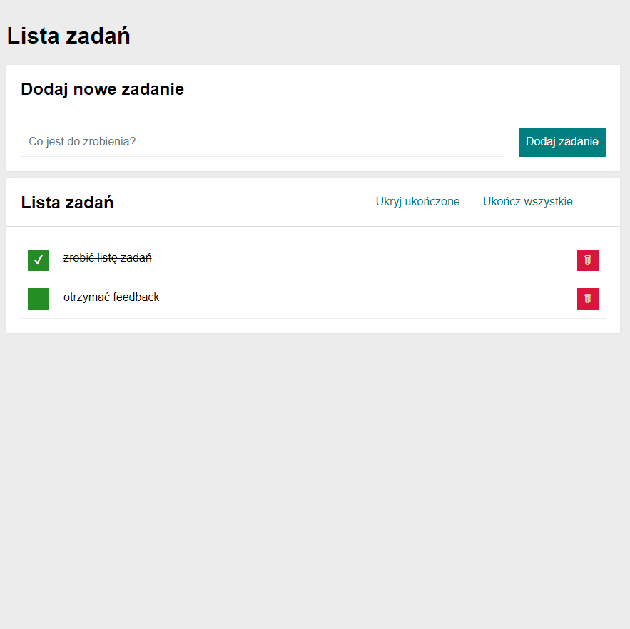

# Hello You, who read this ! 😉

Here's my big step forward [**A To-Do list, this time with React** - feel free to check it out :)](https://woytekmig.github.io/to-do-list-with-react/)

The task ( ;) ) was to make first contact with:  
- [x] **React.js**   
And also using BEM convention in :
- [x] **JS** (ES6)  
- [x] **HTML** 
- [x] **CSS**  

It is another exercise task during YouCode programmig course :) My previous scopes are in my repository. Here's a little demo : 

This time, the target was to rewrite code by using react.js :) I also decided to change language to english. 

# Getting Started with Create React App

This project was bootstrapped with [Create React App](https://github.com/facebook/create-react-app).

## Available Scripts

In the project directory, you can run:

### `npm start`

Runs the app in the development mode.\
Open [http://localhost:3000](http://localhost:3000) to view it in your browser.

The page will reload when you make changes.\
You may also see any lint errors in the console.

### `npm run build`

Builds the app for production to the `build` folder.\
It correctly bundles React in production mode and optimizes the build for the best performance.

The build is minified and the filenames include the hashes.\
Your app is ready to be deployed!

See the section about [deployment](https://facebook.github.io/create-react-app/docs/deployment) for more information.

