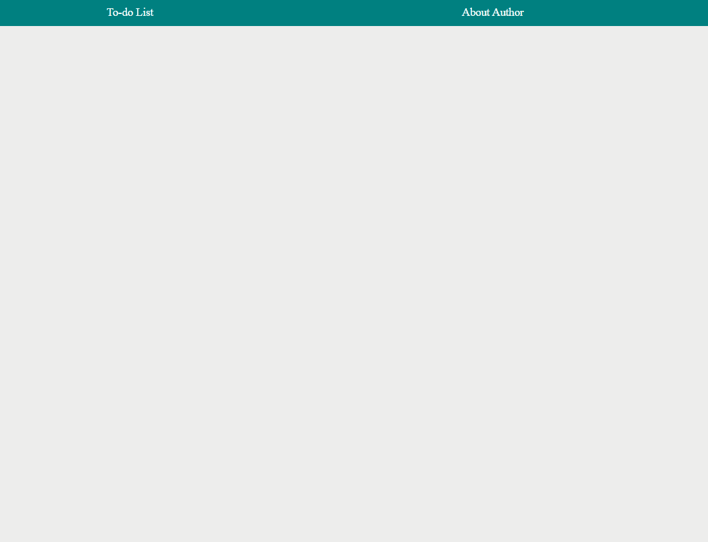

# Hello You, who read this ! 😉

Here's my big step forward [**A To-Do list, this time with React** - feel free to check it out :)](https://woytekmig.github.io/to-do-list-with-react/)

The task ( ;) ) was to make first contact with:  
- [x] **React.js**  
- [x] **React-router**   
- [x] **Redux.js**
- [x] **Redux-saga**  
- [x] **Redux/toolkit**    
And also using BEM convention in :
- [x] **JS** (ES6)  
- [x] **HTML** 
- [x] **CSS**  

It is another exercise task during YouCode programmig course :) My previous scopes are in my repository. Here's a little demo : 

At the beggining, the target was to rewrite code by using react.js :) I also decided to change language to english. Then I needed to add using local storage, to make sure your taks will stay with you, even if you close the app ;) 
I also learned how to use, and then converted app with use of styled-components (including ThemeProvider and GlobalStyle).
Next step was to start using hooks (useRef, useState and useEffect) and even creating one by myself ;) 
Another..task ;) Was to implement Redux to my app. I create store and few reducers. Also I split my files to the common/features folders.
In next steps I implemented redux-saga, redux/toolkit and react-router-dom. Now, you can fetch an example tasks by using async function ;) 
Another features helps you to search your task and to check its details:) 

# Getting Started with Create React App

This project was bootstrapped with [Create React App](https://github.com/facebook/create-react-app).

## Available Scripts

In the project directory, you can run:

### `npm start`

Runs the app in the development mode.\
Open [http://localhost:3000](http://localhost:3000) to view it in your browser.

The page will reload when you make changes.\
You may also see any lint errors in the console.

### `npm run build`

Builds the app for production to the `build` folder.\
It correctly bundles React in production mode and optimizes the build for the best performance.

The build is minified and the filenames include the hashes.\
Your app is ready to be deployed!

See the section about [deployment](https://facebook.github.io/create-react-app/docs/deployment) for more information.

